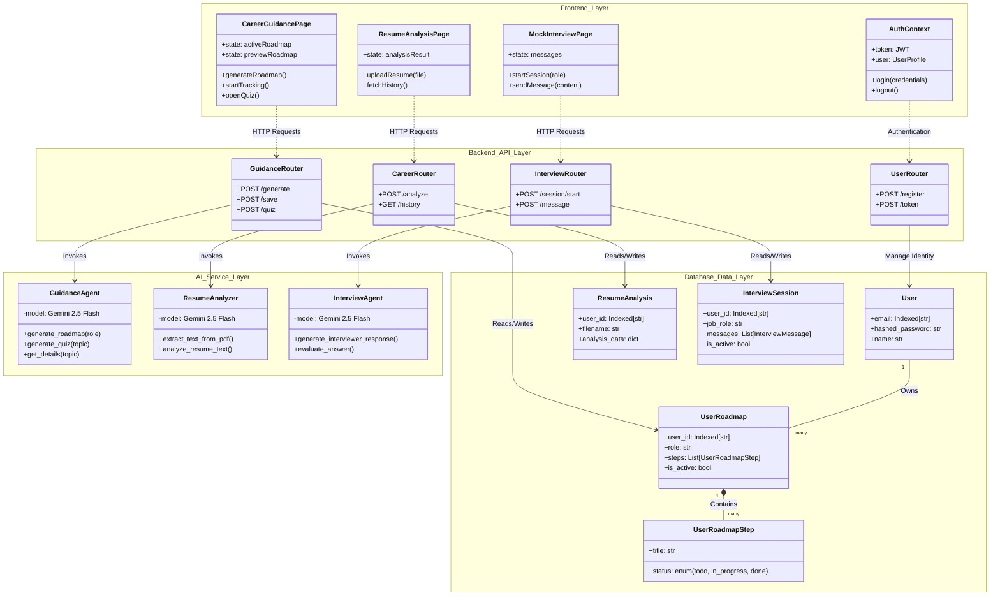

# Low Level Design (LLD) - Career Navigator AI

## 1. Introduction
This document details the Low-Level Design for the **Career Navigator AI** platform. It bridges the High-Level Design (HLD) with the actual code implementation, specifying component structures, data models, and interaction flows.

## 2. System Architecture Diagram
The following class diagram illustrates the interaction between the Frontend components, Backend API routers, AI Service Agents, and the Database Models.

## 3. Component Design

### 3.1 Frontend Components
The frontend is built with **React (Vite)** and styled with **Tailwind CSS** + **Bootstrap**.
- **State Management**:
    - **Local State (`useState`)**: Used for page-specific data like `roadmap` steps, `quiz` scores, and `chat` messages.
    - **Global State (`AuthContext`)**: Manages the JWT authentication token and user profile information accessible across the app.
- **Service Integration**:
    - Direct `axios` calls are made within page components (`CareerGuidance.tsx`, etc.) to backend endpoints.
    - **Authentication**: JWT token is retrieved from `localStorage` and attached to the `Authorization` header for every secure request.

### 3.2 Backend Services (FastAPI)
The backend is structured into modular routers and specialized AI agents.
- **Routers (`/routes`)**:
    - **`users_router`**: Handles registration and login (OAuth2 password flow).
    - **`career_router`**: Manages resume uploads and retrieval of past analyses.
    - **`guidance_router`**: Handles career roadmap generation, progress tracking, and quiz generation.
    - **`interview_router`**: Manages mock interview sessions and message exchanges.
- **AI Agents**:
    - Wrapper classes around **Google Gemini 2.5 Flash** using **LangChain**.
    - **`GuidanceAgent`**: Generates structured JSON for roadmaps and quizzes.
    - **`ResumeAnalyzer`**: Parses PDF content and prompts the LLM for strengths/weaknesses analysis.

### 3.3 Database Schema (MongoDB + Beanie)
Data is stored in **MongoDB** and accessed via **Beanie ODM**.
- **`User`**: Secure storage of user credentials.
- **`ResumeAnalysis`**: JSON storage of AI-generated insights, linked to a user.
- **`UserRoadmap`**: Represents a user's active learning path.
    - **Structure**: Contains a list of `UserRoadmapStep` objects (embedded documents).
    - **State Tracking**: `status` field in steps tracks progress (`todo`, `in_progress`, `done`).
- **`InterviewSession`**: Stores the chat history for context-aware AI responses.

## 4. Key Data Flows

### 4.1 Roadmap Generation
1.  **User** selects a role on `CareerGuidancePage`.
2.  **Frontend** sends `POST /guidance/generate` with `{ job_role }`.
3.  **`GuidanceRouter`** calls `GuidanceAgent.generate_roadmap()`.
4.  **`GuidanceAgent`** prompts Gemini 2.5 Flash to create a step-by-step plan.
5.  **LLM** returns a JSON structure.
6.  **Backend** returns this JSON to Frontend (Status: *Preview*).
7.  **User** clicks "Start Tracking".
8.  **Frontend** sends `POST /guidance/save`.
9.  **Backend** saves the `UserRoadmap` to MongoDB.

### 4.2 Mock Interview
1.  **User** starts a session for a role.
2.  **Backend** creates a new `InterviewSession` document.
3.  **User** sends a message.
4.  **Backend** retrieves the session history from MongoDB.
5.  **`InterviewAgent`** appends the new message and history to the prompt.
6.  **Gemini** generates a response (interviewer persona).
7.  **Backend** saves both user query and AI response to `InterviewSession.messages` and returns the AI response.
